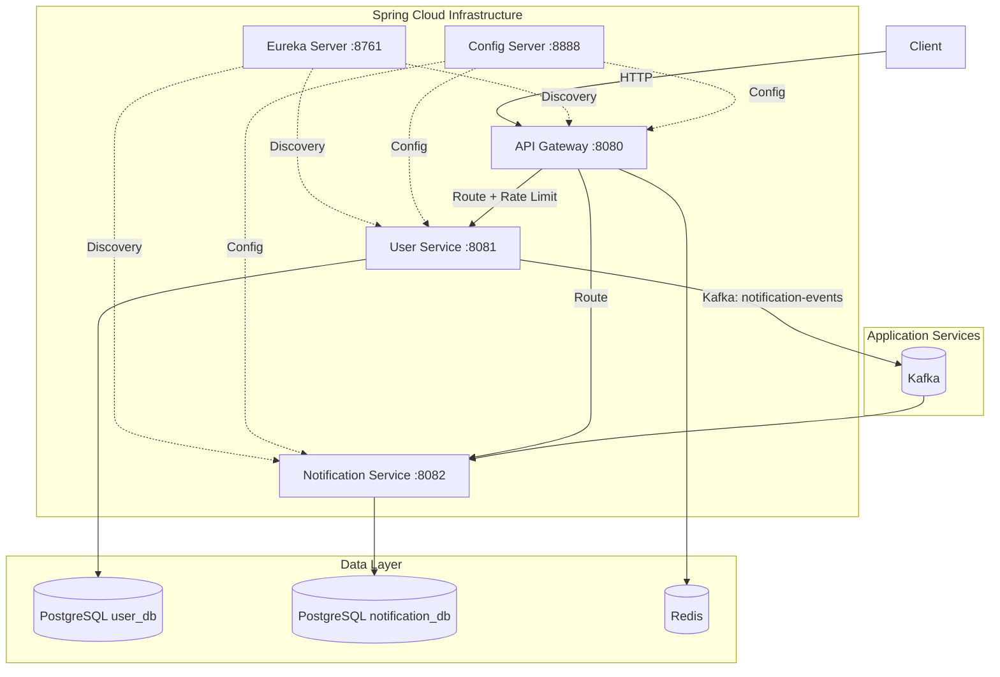
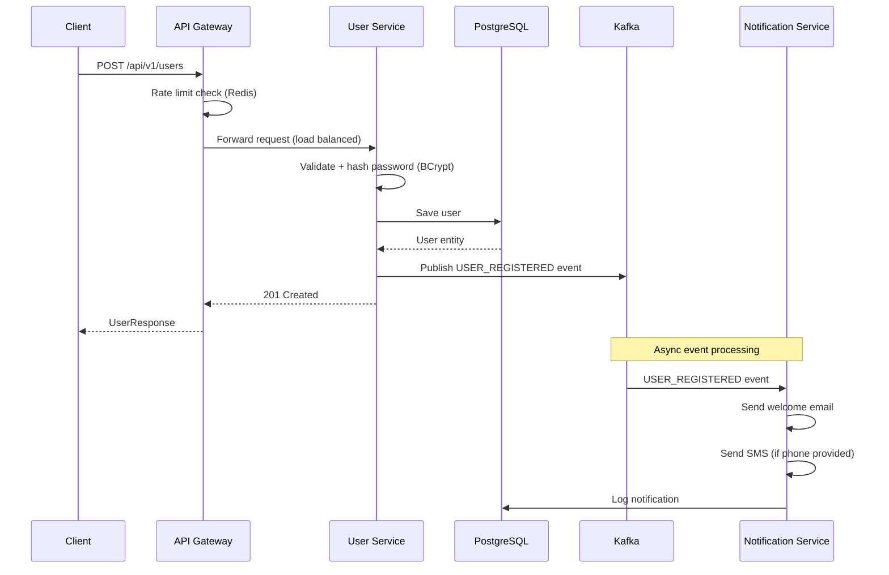
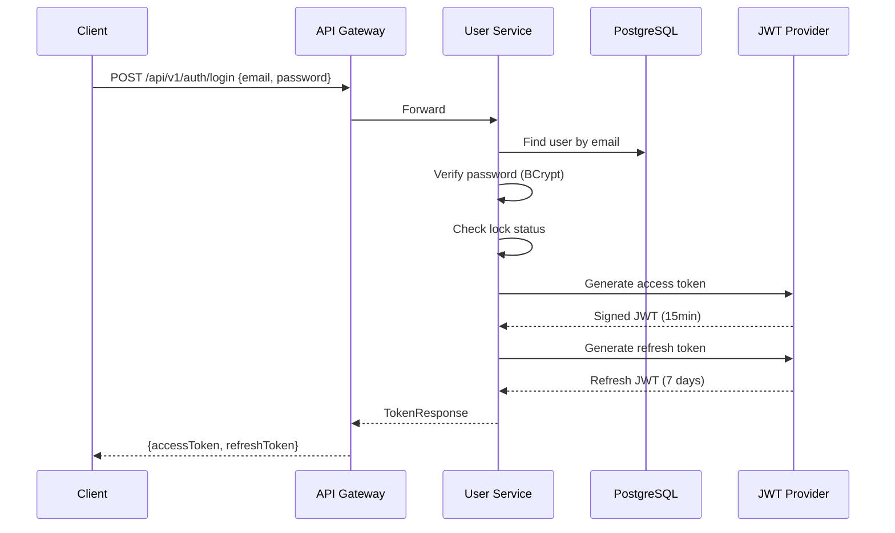
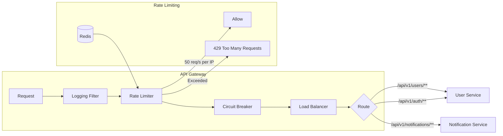
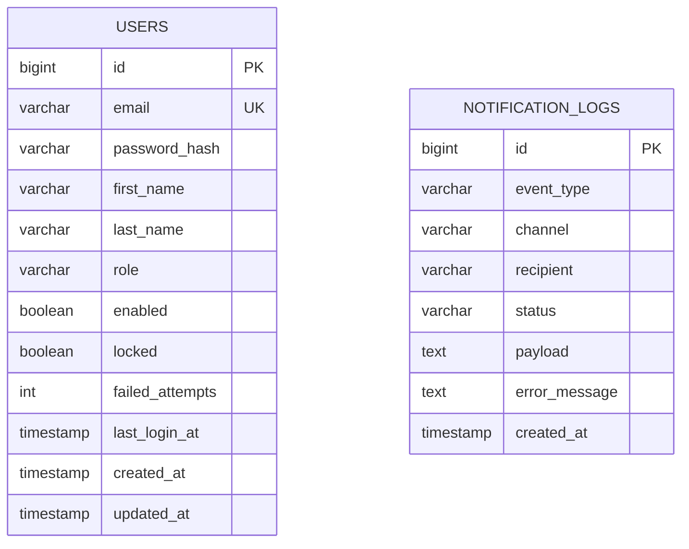

# Architecture

## System Overview

```mermaid
graph TB
    Client[Client] -->|HTTP| GW[API Gateway :8080]

    subgraph "Spring Cloud Infrastructure"
        EUR[Eureka Server :8761]
        CFG[Config Server :8888]
        EUR -.->|Discovery| GW
        EUR -.->|Discovery| US
        EUR -.->|Discovery| NS
        CFG -.->|Config| US
        CFG -.->|Config| NS
        CFG -.->|Config| GW
    end

    subgraph "Application Services"
        GW -->|Route + Rate Limit| US[User Service :8081]
        GW -->|Route| NS[Notification Service :8082]
        US -->|Kafka: notification-events| K[(Kafka)]
        K --> NS
    end

    subgraph "Data Layer"
        US --> PG1[(PostgreSQL user_db)]
        NS --> PG2[(PostgreSQL notification_db)]
        GW --> REDIS[(Redis)]
    end
```

## Request Flow: User Registration

```mermaid
sequenceDiagram
    participant C as Client
    participant GW as API Gateway
    participant US as User Service
    participant DB as PostgreSQL
    participant K as Kafka
    participant NS as Notification Service

    C->>GW: POST /api/v1/users
    GW->>GW: Rate limit check (Redis)
    GW->>US: Forward request (load balanced)
    US->>US: Validate + hash password (BCrypt)
    US->>DB: Save user
    DB-->>US: User entity
    US->>K: Publish USER_REGISTERED event
    US-->>GW: 201 Created
    GW-->>C: UserResponse

    Note over K,NS: Async event processing
    K->>NS: USER_REGISTERED event
    NS->>NS: Send welcome email
    NS->>NS: Send SMS (if phone provided)
    NS->>DB: Log notification
```

## Authentication Flow

```mermaid
sequenceDiagram
    participant C as Client
    participant GW as API Gateway
    participant US as User Service
    participant DB as PostgreSQL
    participant JWT as JWT Provider

    C->>GW: POST /api/v1/auth/login {email, password}
    GW->>US: Forward
    US->>DB: Find user by email
    US->>US: Verify password (BCrypt)
    US->>US: Check lock status
    US->>JWT: Generate access token
    JWT-->>US: Signed JWT (15min)
    US->>JWT: Generate refresh token
    JWT-->>US: Refresh JWT (7 days)
    US-->>GW: TokenResponse
    GW-->>C: {accessToken, refreshToken}
```

## API Gateway Architecture

```mermaid
graph LR
    subgraph "API Gateway"
        REQ[Request] --> LOG[Logging Filter]
        LOG --> RL[Rate Limiter]
        RL --> CB[Circuit Breaker]
        CB --> LB[Load Balancer]
        LB --> ROUTE{Route}
    end

    ROUTE -->|/api/v1/users/**| US[User Service]
    ROUTE -->|/api/v1/auth/**| US
    ROUTE -->|/api/v1/notifications/**| NS[Notification Service]

    subgraph "Rate Limiting"
        REDIS[(Redis)] --> RL
        RL -->|50 req/s per IP| ALLOW[Allow]
        RL -->|Exceeded| REJECT[429 Too Many Requests]
    end
```

## Database Schema

```mermaid
erDiagram
    USERS {
        bigint id PK
        varchar email UK
        varchar password_hash
        varchar first_name
        varchar last_name
        varchar role
        boolean enabled
        boolean locked
        int failed_attempts
        timestamp last_login_at
        timestamp created_at
        timestamp updated_at
    }

    NOTIFICATION_LOGS {
        bigint id PK
        varchar event_type
        varchar channel
        varchar recipient
        varchar status
        text payload
        text error_message
        timestamp created_at
    }
```
